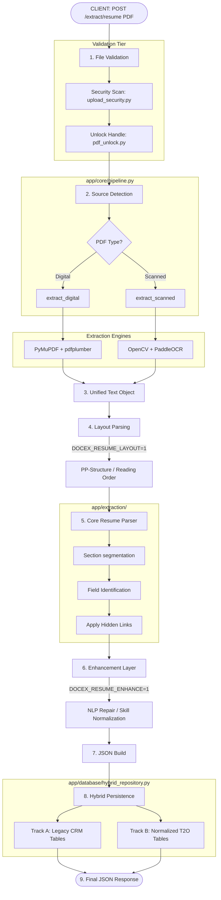

# Resume Extraction Pipeline Architecture

This document outlines the high-level architecture and processing flow of the Resume Extraction Project.

## Processing Workflow

## Detailed Component Breakdown

┌──────────────────────────────┐
│  **CLIENT**                    │
│  [POST /api/v1/extract/resume](app/api/routes/extract.py) (PDF) │
└───────────────┬──────────────┘
                │
                ▼
┌─────────────────────────────────────────────────────────────────────────┐
│ **1. FILE VALIDATION**                      [run_pipeline](app/core/pipeline.py)      │
│    • `assert_upload_safe` (Magic Bytes, JS)  [upload_security.py](app/security/upload_security.py) │
│    • `unlock_pdf` (Remove Owner Passwords)   [pdf_unlock.py](app/security/pdf_unlock.py)           │
└───────────────┬───────────────────────────────────────────────────────────┘
                │
                ▼
┌─────────────────────────────────────────────────────────────────────────┐
│ **2. SOURCE DETECTION**                     [pipeline.py](app/core/pipeline.py)         │
│    `classify_source` → **DIGITAL_PDF**  |  **SCANNED_PDF / IMAGE**          │
└───────┬───────────────────────────────────────┬──────────────────────────┘
        │ *digital path*                         │ *scanned path*
        ▼                                        ▼
┌───────────────────────────┐      ┌─────────────────────────────────────┐
│ **extract_digital**       │      │ **extract_scanned**    [ocr_parser.py](app/core/ocr_parser.py) │
│ [digital_parser.py](app/core/digital_parser.py) │      │ • OpenCV Preprocessing            │
│ • PyMuPDF + pdfplumber    │      │ • PaddleOCR / Tesseract           │
│ • Hidden Link Extraction  │      │ • Barcode-mask & Deskew           │
└───────────┬───────────────┘      └──────────────────┬───────────────────┘
            └──────────────────┬───────────────────────┘
                               │
                               ▼
┌─────────────────────────────────────────────────────────────────────────┐
│ **3. UNIFIED TEXT**  (`ExtractedText` model: pages → text + tables)       │
└───────────────┬───────────────────────────────────────────────────────────┘
                │
                ▼
┌─────────────────────────────────────────────────────────────────────────┐
│ **4. LAYOUT PARSING** [Env: `DOCEX_RESUME_LAYOUT`] [layout_analyzer.py](app/core/layout_analyzer.py) │
│    PP-Structure → reading order / columns / titles / tables               │
│    *Fail-safe: fall back to raw text on analysis error*                   │
└───────────────┬───────────────────────────────────────────────────────────┘
                │
                ▼
┌─────────────────────────────────────────────────────────────────────────┐
│ **5. RESUME PARSER (Core)**                 [app/extraction/](app/extraction/)         │
│    • Contact / Name / Address / Headline / Summary                        │
│    • `_segment` → Match section headers via aliases & regex               │
│    • `_build_section` → Experience, Education, Skills, Projects, etc.     │
│    • `_apply_hidden_links` (LinkedIn, GitHub, Portfolio injection)        │
└───────────────┬───────────────────────────────────────────────────────────┘
                │
                ▼
┌─────────────────────────────────────────────────────────────────────────┐
│ **6. ENHANCEMENT LAYER** [Env: `DOCEX_RESUME_ENHANCE`] [resume_enhancer.py](app/enhancement/resume_enhancer.py) │
│    • Normalize dates (E1)    • Skill splitting (E5)                       │
│    • Section recovery (E2)   • spaCy NER Entities (E6)                    │
│    • Field repairs (E4)      • Cert-URL mapping (E7)                      │
└───────────────┬───────────────────────────────────────────────────────────┘
                │
                ▼
┌─────────────────────────────────────────────────────────────────────────┐
│ **7. JSON BUILD**                           [extract.py](app/api/routes/extract.py)    │
│    `payload = { resume{…sections}, validation, confidence }`              │
└───────────────┬───────────────────────────────────────────────────────────┘
                │
                ▼
┌─────────────────────────────────────────────────────────────────────────┐
│ **8. HYBRID PERSIST** `insert_extraction`   [hybrid_repository.py](app/database/hybrid_repository.py) │
│   ┌─ **LEGACY TRACK** ──────────────┐  ┌─ **NORMALIZED T2O TRACK** ───────┐ │
│   │ `IAPL_CRM_RESUME_PROFILE`       │  │ `Candidates_text_to_ocr`         │ │
│   │ `IAPL_CRM_RESUME_SECTION_ITEM`  │  │ `Work_text_to_ocr` (+raw)        │ │
│   └─────────────────────────────────┘  │ `Skills_text_to_ocr` (+raw)      │ │
│                                        │ `Resume_Raw_Data_text_to_ocr`    │ │
│   *Best-effort: T2O failures never*     └──────────────────────────────────┘ │
│   *break the legacy CRM insertion*                                          │
└───────────────┬───────────────────────────────────────────────────────────┘
                │
                ▼
┌─────────────────────────────────────────────────────────────────────────┐
│ **9. RESPONSE** → JSON                                                  │
│    `{ resume, mapped, validation, confidence, extraction_id, db }`        │
└─────────────────────────────────────────────────────────────────────────┘
