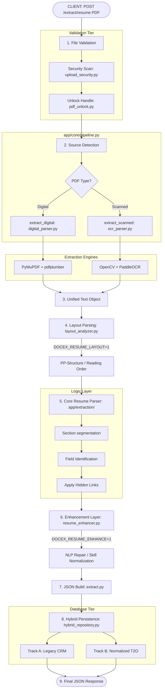

# Resume Extraction Pipeline Architecture

This document outlines the high-level architecture and processing flow of the Resume Extraction Project.

## Processing Workflow



## Detailed Component Breakdown

```text
┌──────────────────────────────┐
│  CLIENT                       │
│  POST /extract/resume (PDF)   │
└───────────────┬──────────────┘
                │
                ▼
┌─────────────────────────────────────────────────────────────────────────┐
│ 1. FILE VALIDATION                         resume_api.py                  │
│    • assert_upload_safe (type / size / security)   upload_security.py     │
│    • unlock_pdf (password-protected?)              pdf_unlock.py          │
└───────────────┬───────────────────────────────────────────────────────────┘
                │
                ▼
┌─────────────────────────────────────────────────────────────────────────┐
│ 2. SOURCE DETECTION                        pipeline.py                     │
│    classify_source → DIGITAL_PDF  |  SCANNED_PDF / IMAGE                   │
└───────┬───────────────────────────────────────┬──────────────────────────┘
        │ digital                                │ scanned / image
        ▼                                        ▼
┌───────────────────────────┐      ┌─────────────────────────────────────┐
│ extract_digital           │      │ extract_scanned        extract.py    │
│   PyMuPDF + pdfplumber     │      │   OpenCV preprocess (deskew, denoise │
│   + hidden hyperlinks      │      │   barcode-mask, OSD) → PaddleOCR /   │
│            extract.py      │      │   Tesseract                          │
└───────────┬───────────────┘      └──────────────────┬───────────────────┘
            └──────────────────┬───────────────────────┘
                               │
                               ▼
┌─────────────────────────────────────────────────────────────────────────┐
│ 3. UNIFIED TEXT  (ExtractedText: pages → text + tables)                    │
└───────────────┬───────────────────────────────────────────────────────────┘
                │
                ▼
┌─────────────────────────────────────────────────────────────────────────┐
│ 4. LAYOUT PARSING  [ON • DOCEX_RESUME_LAYOUT=1]      layout_parser.py      │
│    PP-Structure → reading order / columns / titles                        │
│    fail-safe: on any error → original text                                │
└───────────────┬───────────────────────────────────────────────────────────┘
                │
                ▼
┌─────────────────────────────────────────────────────────────────────────┐
│ 5. RESUME PARSER (core)                     resume.py                      │
│    • contact / name / address / headline                                  │
│    • _segment  → _match_section_header  (header + despace + aliases)       │
│    • _build_section → experience / education / skill / project /           │
│      certification / language / achievement items                         │
│    • _apply_hidden_links (fill empty LinkedIn/GitHub/Portfolio)            │
└───────────────┬───────────────────────────────────────────────────────────┘
                │
                ▼
┌─────────────────────────────────────────────────────────────────────────┐
│ 6. ENHANCEMENT LAYER  [OFF • DOCEX_RESUME_ENHANCE=0]  resume_enhance.py    │
│    ──── currently SKIPPED (no-op) ────                                     │
│    (normalize · section-recovery · headerless-exp · field-repairs ·       │
│     skill-split · validator · fuzzy · spaCy entities · cert-url mapper)    │
└───────────────┬───────────────────────────────────────────────────────────┘
                │
                ▼
┌─────────────────────────────────────────────────────────────────────────┐
│ 7. JSON BUILD                               resume_api.py / schema.py      │
│    payload = { resume{…sections}, validation, confidence,                  │
│               mapped = build_resume_t2o(doc) }      db/procedures.py       │
└───────────────┬───────────────────────────────────────────────────────────┘
                │
                ▼
┌─────────────────────────────────────────────────────────────────────────┐
│ 8. PERSIST  insert_extraction()                     db/procedures.py       │
│   ┌─ legacy ──────────────────────┐  ┌─ normalized *_text_to_ocr ───────┐ │
│   │ IAPL_CRM_RESUME_PROFILE        │  │ Candidates_text_to_ocr           │ │
│   │ IAPL_CRM_RESUME_SECTION_ITEM   │  │  (+ file_path, inserted_date,    │ │
│   └────────────────────────────────┘  │   inserted_by)                   │ │
│                                        │ Educations_text_to_ocr (+raw_text)│ │
│   best-effort: t2o failure never       │ Companies / Skills / Languages / │ │
│   breaks the legacy insert              │ Work / Projects / Certs / …      │ │
│                                        │ Resume_Raw_Data_text_to_ocr      │ │
│                                        │  (raw_text_resume + json_data)   │ │
│                                        └──────────────────────────────────┘ │
└───────────────┬───────────────────────────────────────────────────────────┘
                │
                ▼
┌─────────────────────────────────────────────────────────────────────────┐
│ 9. RESPONSE  → JSON  { resume, mapped, validation,                         │
│                       confidence, extraction_id, db, source_file_url }     │
└───────────────────────────────────────────────────────────────────────────┘
```
